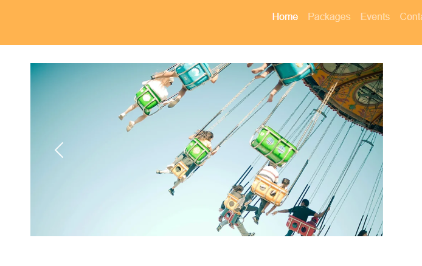
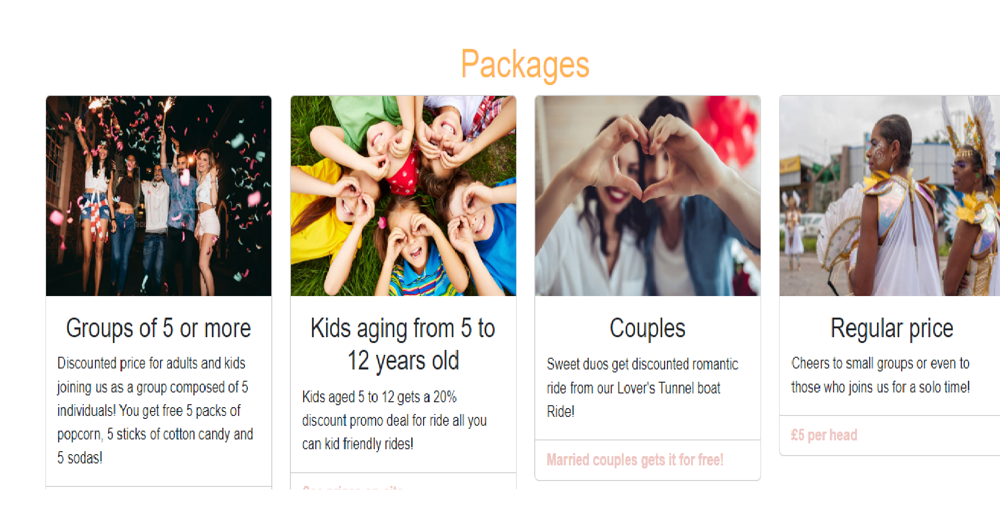
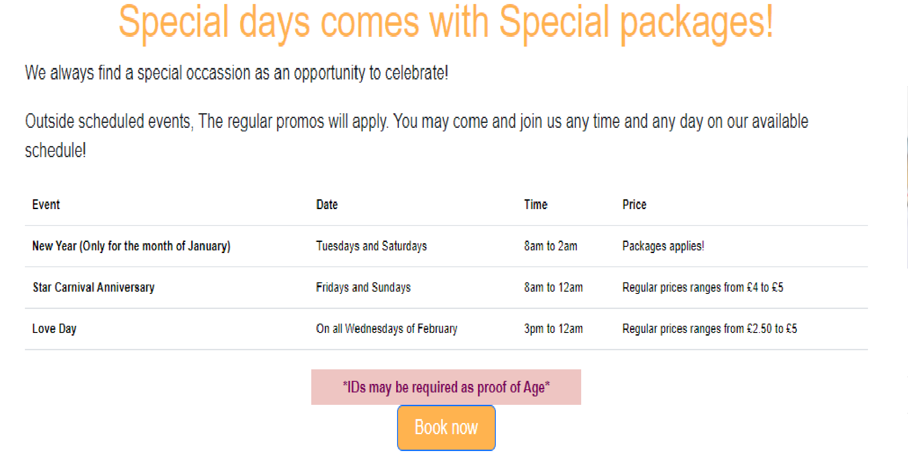
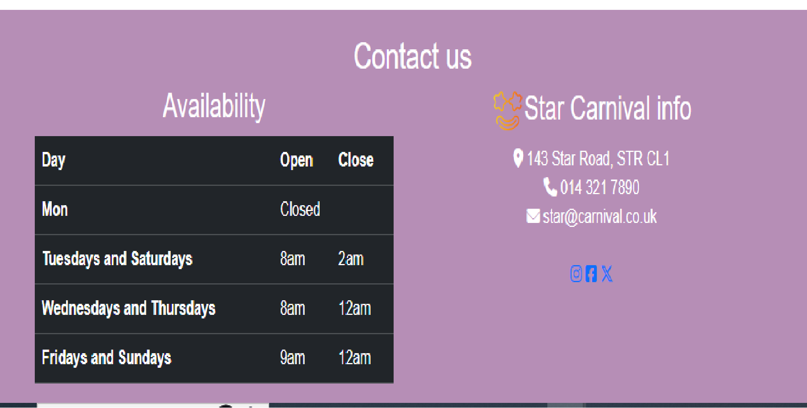
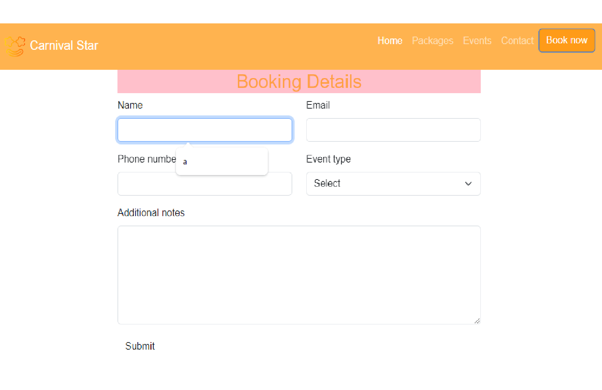

# Carnival Star

Carnival Star is a website for online booking and informational queries. This place contains rides, games, food and drinks stalls, entertainment and activities for people and even pets. The website provides information on promos, packages, events and prices that can be availed. I also gives convenience for those who lives afar from the address of the carnival.

## Features

### Existing Features

- __Navigation Bar__

  - The navigation bar contains clickable texts such as home, which leads to the first page, packages which leads to the part of the page where the promos are offered, events and an option to book a slot.
  - This section will allow the user to easily navigate from page to page across all devices without having to revert back to the previous page via the ‘back’ button. 

![Navigation Bar] (assets/images/readme_images/nav bar.png)

- __Carousel pictures__

  - This carousel includes a few images that autoswipes and can be navigated by clicking the next and previous arrow buttons

- __Packages Section__

  - The Packages section shows the promos a person may avail. It contains the number of people it includes, the age group, and also the prices.
  - The viewer will see the better offers Star Carnival provides for all. 

- __Meetup Times section__

  - This section provides the enumeration of events and dates when such events are going to take place
  - This section will be updated as these times change to keep the user up to date. 

- __The Footer__ 

  - The footer section includes links to the relevant social media sites for Star Carnival. The links will open to a new tab to allow easy navigation for the user. 
  - The footer also contain the opening and closing time and days of Star Carnival.
  - The footer is valuable to the user as it encourages them to keep connected via social media as well as the necessary contact information.

- __Booking Page__

  - This page will allow the user to book a slot reservation and pick a promo of their choice online. The user will be asked to submit their full name and email address. 

For some/all of your features, you may choose to reference the specific project files that implement them.

## Testing 

The website runs in terms of information, navigation and buttons.

It has been tested a few times on different devices as well.

### Validator Testing 

- HTML
  - No errors were returned when passing through the official [W3C validator](assets/images/readme_images/html-validation.png)
- CSS
  - No errors were found when passing through the official [(Jigsaw) validator](assets/images/readme_images/css-validation.png)

### Unfixed Bugs

There are no unfixed bugs.

## Deployment

This section should describe the process you went through to deploy the project to a hosting platform (e.g. GitHub) 

- The site was deployed to GitHub pages. The steps to deploy are as follows: 
  - In the GitHub repository, navigate to the Settings tab 
  - From the source section drop-down menu, select the Master Branch
  - Once the master branch has been selected, the page will be automatically refreshed with a detailed ribbon display to indicate the successful deployment. 

The live link can be found here - https://github.com/jammy-8/carnival-star/blob/main/index.html

## Credits 

__Images__
- https://c0.klipartz.com/pngpicture/167/216/sticker-png-kirby-s-return-to-dream-land-kirby-super-star-ultra-kirby-s-epic-yarn-kirby-s-adventure-hooray.png
- https://media.istockphoto.com/id/955152328/photo/carnival-celebration-event-at-curacao-two-women-dressing-costumes-watch-the-parade.jpg?s=612x612&w=0&k=20&c=JF6nF7iAVvGAt6JUHZagtrtfv2lk_T_njPOxtr5fIRs=
- https://catholicweekly.com.au/wp-content/uploads/2020/03/O68Z3N0-scaled.jpg
- https://t4.ftcdn.net/jpg/01/87/46/65/360_F_187466557_4p1Ojx57J7GwxMUiZqYV957D1zaavWHp.jpg
- https://jacoblund.com/cdn/shop/products/photo-id-2084854825029-group-of-people-having-a-party_1200x800.jpg?v=1563829158
- https://encrypted-tbn0.gstatic.com/images?q=tbn:ANd9GcSSA8Fbb2_hlJR_5JvvM3BleNWWpj_4Ck9MCYd0uI7RNcvSIwXueYPOE38RhbZ7fqalxoY&usqp=CAU
- https://www.bpmcdn.com/f/files/vernon/import/2023-02/31794395_web1_230209-VMS-Carnival-photos-balloons_3.jpg;w=960;h=640;bgcolor=000000
- https://static.wixstatic.com/media/2fcea2e8bd564e9ebd24e44dde8e0179.jpg/v1/fill/w_980,h_653,al_c,q_85,usm_0.66_1.00_0.01,enc_auto/2fcea2e8bd564e9ebd24e44dde8e0179.jpg
- https://i0.wp.com/awesome.blog/wp-content/uploads/2006/02/105075230_3b8464f2a7-1.jpg?quality=89&ssl=1
- https://img.freepik.com/premium-photo/golden-mask-star-glitter-purim-carnival-decoration_1208970-76053.jpg?w=360
- https://img.freepik.com/premium-photo/golden-mask-star-glitter-purim-carnival-decoration_1208970-76053.jpg?w=360
- https://favicon.io/8b128aaa-55d8-44fe-b443-2182449b5c59
- https://c8.alamy.com/comp/2XY6BGT/cute-kawaii-star-character-takes-a-selfie-isolated-cartoon-vector-cool-twinkle-personage-wearing-sunglasses-with-happy-smile-rosy-cheeks-and-cheerful-face-snaps-a-mobile-shots-radiating-pure-joy-2XY6BGT.jpg

### Content 

- The text for the Home page was personally composed by the student.
- The icons in the footer were taken from [Font Awesome](https://fontawesome.com/)

### Media

- The photos used on the home and sign up page are from This Open Source site
- The images used for the gallery page were taken from this other open source site
